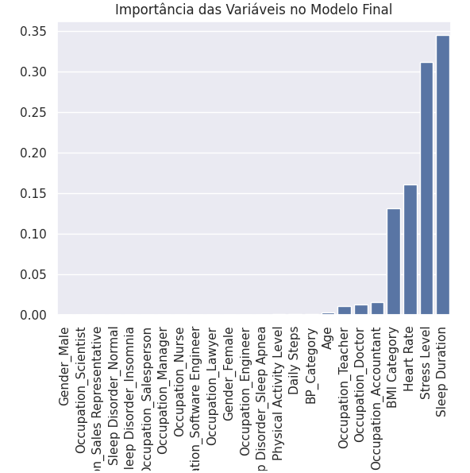

# 😴 Dashboard de Previsão de Qualidade de Sono

## 📋 Sobre o Projeto

O **Dashboard de Previsão de Qualidade de Sono** é uma aplicação de Data Science interativa desenvolvida para analisar como hábitos diários e métricas de saúde impactam a qualidade do descanso.

O objetivo principal é auxiliar usuários a identificarem padrões em sua rotina (como níveis de estresse, atividade física e duração do sono) e receberem uma estimativa quantitativa (Score 0-10) sobre a qualidade do seu sono, permitindo tomadas de decisão para uma vida mais saudável.

### Principais Funcionalidades:
* **Interface Interativa:** Construída com Streamlit para fácil inserção de dados.
* **Previsão em Tempo Real:** Cálculo instantâneo do score de sono baseado no perfil do usuário.
* **Pipeline Automatizada:** Processamento de dados (OneHotEncoding, OrdinalEncoding e Scaling) integrado à aplicação.
* **Diagnóstico Visual:** Uso de gráfico para facilitar a interpretação do resultado.

---

## 🤖 Sobre o Modelo (Machine Learning)

Para chegar à solução final, a equipe realizou uma bateria de testes comparativos entre diversos algoritmos de aprendizado de máquina, incluindo:
* Regressão Linear, Lasso e Ridge
* KNN (K-Nearest Neighbors)
* SVM (Support Vector Machine)
* Random Forest
* Árvore de Decisão

### O Vencedor: XGBoost 🚀
Após a validação cruzada e análise de métricas de desempenho (RMSE e R²), o modelo **XGBoost (Extreme Gradient Boosting)** foi selecionado como o motor de inferência da aplicação. Ele foi escolhido por sua alta capacidade de generalização e robustez ao lidar com dados tabulares complexos.

## 🧠 Pesos do Modelo (Interpretabilidade)

Como utilizamos o algoritmo **XGBoost**, a interpretação dos pesos é feita através da **Importância das Variáveis**. O gráfico abaixo mostra quais fatores mais influenciam a previsão da qualidade do sono:



### 📊 Análise dos Pesos:
1.  **Duração do Sono (Sleep Duration):** É, de longe, o fator mais determinante para a nota final.
2.  **Nível de Estresse (Stress Level):** O segundo fator mais importante, indicando forte correlação negativa.
3.  **Frequência Cardíaca (Heart Rate):** Terceiro fator de maior impacto.
4.  **Variáveis Categóricas:** Fatores como Gênero e Ocupação têm impacto muito menor (próximo de zero) na decisão do modelo comparado aos dados fisiológicos.

## 📁 Estrutura do Projeto

```
PS-LIGIA/
│
├── .venv/                              # Ambiente virtual (não versionado)
├── .gitignore                          # Arquivos ignorados pelo Git
├── requirements.txt                    # Lista de dependências do projeto
├── README.md                           # Documentação do projeto
├── app.py                              # Aplicação Principal (Dashboard Streamlit)
│
├── EDA/                                # Análise exploratória de dados
│   ├── EDA 1.ipynb                     # 
│   ├── EDA 2.ipynb                     # 
│   └── EDA 3.ipynb                     # 
|
├── Modelo_Final/                       # Artefatos utilizados na aplicação (Produção)
│   ├── modelo_XGBoost.joblib           # Modelo preditivo treinado
│   ├── scaler.joblib                   # Escalonador (Normalização de dados)
│   ├── ohe_encoder.joblib              # Encoder para variáveis categóricas (OneHot)
│   ├── ord_encoder.joblib              # Encoder para variáveis ordinais
│   ├── colunas.joblib                  # Lista de colunas usadas no modelo
|   └── Importancia_das_variaveis.png
│
└── Modelos Testados/                   # Laboratório de experimentos e testes
    ├── Dataset tratado/                # Dados processados e split (treino/teste)
    │   ├── Pré_processamento...ipynb   # Código de pre-processamento dos dados
    │   ├── train_... .csv
    │   ├── test_... .csv
    │   └── val_... .csv
    │
    ├── Arvore_de_Decisão - Daniel Nascimento.ipynb
    ├── KNN - André Ferrão.ipynb
    ├── Lasso_Regression - Nicole Layse.ipynb
    ├── LinearRegression - Adriana Melcop.ipynb
    ├── Random_Forest - Amanda Arruda.ipynb
    ├── Ridge_Regression - Diogo Cavalcanti.ipynb
    ├── svm_linear - Bruno Henrique.ipynb
    ├── SVM_SVR_COM_RBF_KERNEL - Davi José.ipynb
    └── XGBoost - Cauã Emanuel.ipynb
```


## 🔧 Instalação

### Windows

1. **Clone ou baixe o projeto:**
```bash
git clone https://github.com/Daniel-Nas/PS-Ligia
cd PS-Ligia
```

2. **Crie um ambiente virtual:**
```bash
python -m venv venv
```

3. **Ative o ambiente virtual:**
```bash
venv\Scripts\activate
```

4. **Instale as dependências:**
```bash
pip install -r requirements.txt
```

### Linux/Mac

1. **Clone ou baixe o projeto:**
```bash
git clone https://github.com/Daniel-Nas/PS-Ligia
cd PS-Ligia
```

2. **Crie um ambiente virtual:**
```bash
python3 -m venv .venv
```

3. **Ative o ambiente virtual:**
```bash
source .venv/bin/activate
```

4. **Instale as dependências Python:**
```bash
pip install -r requirements.txt
```

## 🚀 Como Executar

1. **Certifique-se de que o ambiente virtual está ativado:**
   - Windows: `venv\Scripts\activate`
   - Linux/Mac: `source venv/bin/activate`

2. **Execute o arquivo:**
```bash
streamlit run app.py
```

## 👥 Equipe desenvolvedora

- Adriana Theil Melcop de Castro
- Amanda Arruda de Melo Silva 
- André Ferrão de Oliveira
- Bruno Henrique Ferreira Pinto 
- Cauã Emanuel de Oliveira Rêgo 
- Daniel Nascimento da Silva
- Davi José de Santana Barbosa
- Diogo Cavalcanti Carneiro de Albuquerque 
- Nicole Leíse de Andrade Serra

**Desenvolvido para o Processo seletivo - LIGIA 2026**